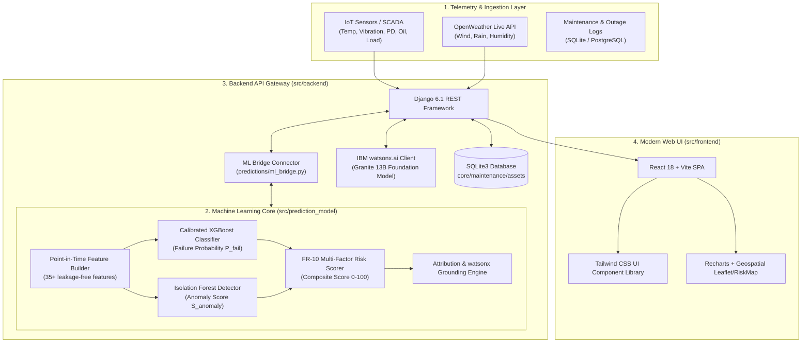
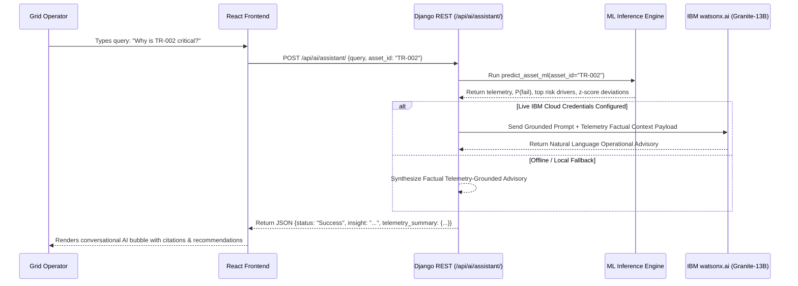

# Architecture Specification: GridGuard AI

## 1. System Architecture Overview

GridGuard AI adopts a decoupled, modular, microservice-ready architecture designed for high scalability, sub-second inference latency, and high operational reliability.

---

## 2. Component Breakdown

### A. Machine Learning Subsystem (`src/prediction_model`)
- **Leakage-Free Feature Engineering (`features/`):** Strict cutoff-time feature extraction guarantees zero lookahead leakage. 
  - *Sensor Features:* `temp_mean_24h`, `temp_max_24h`, `vibration_rms_24h`, `vibration_crest_factor_24h`, `partial_discharge_spike_count_72h`, `oil_quality_decay_rate_7d`, `load_current_mean_24h`, `voltage_deviation_std_24h`.
  - *Weather Features:* `composite_weather_risk`, `wind_gust_max_24h`, `rain_total_24h`, `storm_level_max_24h`.
  - *Asset History:* `age_years`, `days_since_last_maintenance`, `overdue_maintenance_flag`, `historical_risk_index`.
- **Failure Model (`models/failure/`):** XGBoost binary classifier wrapped with `CalibratedClassifierCV(method='sigmoid', cv='prefit')` to ensure predicted scores represent mathematically calibrated probabilities.
- **Anomaly Detector (`models/anomaly/`):** Multivariate `IsolationForest(contamination=0.08, n_estimators=150)` producing normalized anomaly severities and physical baseline z-score decompositions.
- **Scoring Engine (`scoring/`):** Executes the SRS FR-10 formula with externalized weights configured in `config/risk_weights.yaml`.
- **Model Registry (`registry/`):** Version-controlled model bundles stored in `artifacts/`, including fitted pipelines, calibrated models, and evaluation metadata.

---

## 3. IBM watsonx.ai Integration Flow

---

## 4. REST API Contract Specification

| Method | Endpoint | Description | Request / Query | Sample Response Key Fields |
|---|---|---|---|---|
| `GET` | `/api/dashboard/` | High-level grid KPI summary | None | `overall_grid_risk`, `risk_summary`, `maintenance_summary` |
| `GET` | `/api/assets/ranking/` | Multi-factor risk sorted assets | None | `ranking`: `[{asset_id, risk_score, risk_level, priority}]` |
| `GET` | `/api/assets/{id}/details/` | Deep-dive telemetry for asset | Path: `asset_id` | `asset`, `telemetry`, `risk`, `maintenance` |
| `POST` | `/api/risk/analyze/` | Real-time ML risk calculation | JSON: `{asset_id, temperature, vibration, partial_discharge, oil_quality, wind_speed, rainfall}` | `assessment`: `asset`, `telemetry`, `risk`, `grid_impact`, `maintenance`, `ml_details` |
| `POST` | `/api/ai/assistant/` | watsonx.ai conversational advisor | JSON: `{query, asset_id}` | `status`, `mode`, `insight`, `telemetry_summary` |
| `GET` | `/api/weather/live/` | Real-time OpenWeather data | Query: `?city=Vadodara` | `city`, `temperature`, `humidity`, `wind_speed`, `rainfall` |
| `GET` | `/api/maintenance/history/` | Field maintenance log registry | None | `maintenance_logs`: `[{id, priority, action, status}]` |
| `POST` | `/api/maintenance/{id}/status/` | Update ticket state | JSON: `{status: "In Progress"}` | `status: "Success"`, updated log details |

---

## 5. Security, Resilience & Scalability
1. **CORS Isolation:** Granularly configured via `django-cors-headers` for development (`CORS_ALLOW_ALL_ORIGINS = True`) and production domain whitelisting.
2. **Graceful Fallbacks:** The frontend API service (`services/api.js`) and Django views feature multi-tier fallback architectures—ensuring continuous system uptime even if external APIs or network adapters experience transient failures.
3. **Point-in-Time Integrity:** Strict timestamp masking prevents data leakage during training, cross-validation, and live inference.
